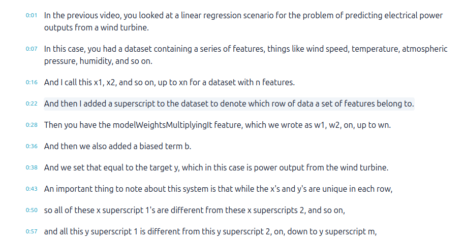

<div dir="rtl" align="right">

# SubDrop

[English](README.md) | فارسی

</div>

<div dir="rtl" align="right">

## این ایده از کجا اومد و به چه دردی می‌خوره؟

تصمیم گرفتم کورس‌های ریاضیِ یادگیری ماشین رو توی deeplearning.ai ببینم؛ اما یه مشکل بود: ویدیوها انگلیسی بودن و زبان مادری من فارسیه.

چند تا راه داشتم:

۱. **افزونه‌های رایگان فایرفاکس** — ولی ترجمه‌شون کلمه‌به‌کلمه و تحت‌اللفظی بود؛ مثلاً «bias» رو «تعصب» ترجمه می‌کردن!

۲. **ترجمهٔ داخلی خود فایرفاکس** — که همون مشکل راه اول رو داشت.

۳. **افزونه‌هایی که متن رو با API هوش مصنوعی ترجمه می‌کنن** — ولی پولی بودن.

۴. **آخرین راه:** اینکه Transcript خود سایت deeplearning.ai رو کپی کنم، با هوش مصنوعی ترجمه‌ش کنم، و بعد سعی کنم متن ترجمه‌شده رو همزمان با ویدیو دنبال کنم و هماهنگ نگهش دارم!!!

اینجا بود که ایده شکل گرفت: چرا همین متن ترجمه‌شده رو نذارم همون‌جایی که زیرنویسِ سایت می‌شینه و راحت ازش استفاده نکنم؟ هم رایگانه، هم ترجمه دقیق و تخصصی داره، هم راحته — مخصوصاً وقتی خود سایت Transcript می‌ده؛ و از قضا deeplearning.ai زیرنویس انگلیسی‌اش رو خیلی تمیز و به همین شکل در اختیار می‌ذاره:


</div>
<div dir="rtl" align="right">
SubDrop همون حلقهٔ گم‌شده‌ست: هر متنی که ترجمه کردی (یا هر فایل `.srt`/`.vtt`) رو می‌گیره، می‌ذاره رو ویدیو، و تا آخر با زمان ویدیو هماهنگ نگهش می‌داره.

</div>


<div dir="rtl" align="right">

## SubDrop چیکار می‌کنه؟

یه افزونهٔ فایرفاکسه که فایل زیرنویس `.srt` یا `.vtt` رو روی ویدیوی هر صفحه‌ای نشون می‌ده و خودش رو با زمان ویدیو هماهنگ نگه می‌داره. فارسی و راست‌به‌چپ کامل پشتیبانی می‌شه.

همچنین می‌تونه زیرنویس خود سایت رو استخراج کنه تا کپیش کنی، با هوش مصنوعی ترجمه‌ش کنی و بعد به‌عنوان زیرنویس فارسی لودش کنی. خود افزونه ترجمه نمی‌کنه — رایگان می‌مونه و کار ترجمه رو می‌ذاره گردن ابزار خودت.

## امکانات

- **نمایش زیرنویس** روی هر ویدیویی؛ با جلو/عقب بردن ویدیو هم لحظه‌ای درست می‌شه
- **فارسی و راست‌به‌چپ** — جهت هر خط خودش تشخیص داده می‌شه و فونت فارسی هم داره
- **نوار کوچیک وضعیت** گوشهٔ صفحه: یه نقطهٔ رنگی + اسم فایل و تعداد زیرنویس‌ها
- **حافظه برای هر سایت** — زیرنویس به‌خاطر سپرده می‌شه و با refresh یا برگشتن به سایت خودکار برمی‌گرده
- **جبران اختلاف زمان (Offset)** — با گام ۰.۱ ثانیه جلو/عقب ببر؛ برای هر سایت جدا ذخیره می‌شه
- **شخصی‌سازی ظاهر** — رنگ متن (سیاه/سفید)، اندازهٔ فونت (خودکار یا ثابت)، و فونت (Vazirmatn، Noto Naskh/Sans/Kufi Arabic، Nastaliq، Tahoma و…)
- **استخراج زیرنویس سایت** به چهار روش:
  ۱. `<track src>` سایت — فایل مستقیم `.vtt`/`.srt` یا پلی‌لیست HLS
  ۲. TextTrack هایی که خود پلیر ساخته و پر کرده
  ۳. TextTrack هایی که فقط وقتی فعال بشن پر می‌شن (پلیرهایی مثل YouTube/Vimeo)
  ۴. **URL دستی** — اگه هیچ‌کدوم نبود، آدرس فایل زیرنویس رو بده تا خودش بگیره
- **کپی به شکل SRT یا متن ساده** — خروجی SRT دوباره قابل لوده
- **چسباندن از کلیپ‌بورد** — متن زیرنویسی که هر جا کپی کرده‌ای (مثلاً جواب هوش مصنوعی) بدون ساختن فایل، مستقیم روی ویدیو می‌شینه
- **فول‌اسکرین** — زیرنویس داخل المان فول‌اسکرین جابه‌جا می‌شه و دیده می‌شه

## نصب

SubDrop توی فروشگاه رسمی افزودنی‌های فایرفاکس هست:

۱. صفحهٔ افزونه رو توی [addons.mozilla.org](https://addons.mozilla.org) باز کن — **SubDrop** رو جست‌وجو کن
۲. **Add to Firefox** رو بزن و تأیید کن
۳. تب ویدیو رو refresh کن — تمام

## طرز استفاده

**لود فایل زیرنویس:** توی پاپ‌آپ روی **Choose subtitle file** بزن؛ یه پنجرهٔ کوچیک باز می‌شه، فایل رو انتخاب کن یا بکش و رها کن توش. خودش بسته می‌شه و زیرنویس همون لحظه می‌شینه رو ویدیو. (می‌تونی فایل رو مستقیم روی نوار وضعیت گوشهٔ صفحه هم رها کنی.)

**چسباندن متن زیرنویس:** اگه متن زیرنویس از قبل روی کلیپ‌بوردته — مثلاً جواب هوش مصنوعی — توی پاپ‌آپ **Paste from clipboard** رو بزن تا بدون ذخیره‌کردن فایل لود بشه. متن اول چک می‌شه: چیزی که timestamp معتبر SRT/VTT نداشته باشه با پیام خطا رد می‌شه و زیرنویسی که الان رو ویدیوئه دست‌نخورده می‌مونه.

چرا پنجره؟ فایرفاکس پاپ‌آپ رو همون لحظه که پنجرهٔ انتخاب فایل باز می‌شه می‌بنده؛ با یه پنجرهٔ جدا این مشکل کلاً پیش نمیاد.

**گردش کار با هوش مصنوعی:**

۱. پاپ‌آپ → بخش **Extract captions** → زبان رو انتخاب کن
۲. **Copy SRT** رو بزن
۳. متن رو بده به هوش مصنوعی و بگو فقط متن خط‌ها رو ترجمه کنه و timestamp ها رو دست نزنه
۴. خروجی رو کپی کن و توی پاپ‌آپ **Paste from clipboard** رو بزن — تمام، دیگه فایلی برای ذخیره‌کردن نیست. (اگه بخوای می‌تونی به‌صورت `.srt` ذخیره‌ش کنی و با **Choose subtitle file** لودش کنی.)

## محدودیت‌ها

- پنجرهٔ Picture-in-Picture پشتیبانی نمی‌شه (نمی‌شه توش چیزی تزریق کرد)
- پلیرهای DRM (مثل Netflix) کار نمی‌کنن
- استخراج زیرنویس به ساختار هر سایت وابسته‌ست؛ چهار روش بالا سایت‌های رایج رو پوشش می‌ده ولی برای همهٔ سایت‌ها تضمینی نیست

## حریم خصوصی

هیچ داده‌ای جایی فرستاده نمی‌شه و هیچ آماری جمع نمی‌شه. تنها درخواست شبکه همون فایل زیرنویسیه که خودت آدرسش رو می‌دی (برای استخراج کپشن). زیرنویس‌ها و تنظیمات فقط روی سیستم خودت ذخیره می‌شن. کلیپ‌بورد هم فقط همون لحظه‌ای خونده می‌شه که خودت **Paste from clipboard** رو بزنی، و محتواش از سیستم تو بیرون نمی‌ره.

## ساختار فایل‌ها

```
manifest.json    تعریف افزونه (MV2)
parser.js        پارسر SRT/VTT + تشخیص انکودینگ + ساخت SRT
content.js       نمایش زیرنویس، هماهنگی، نوار وضعیت، حافظهٔ هر سایت
popup.html/js    پاپ‌آپ
picker.html/js   پنجرهٔ انتخاب فایل
background.js    گرفتن فایل زیرنویس از دامنه‌های دیگه
docs/            تصاویر
```

## لایسنس

[MIT](LICENSE)
</div>
